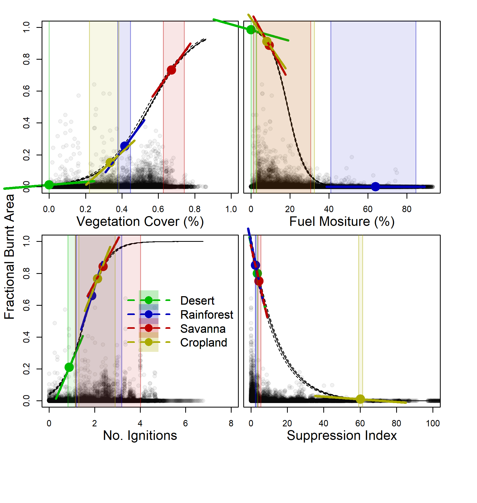
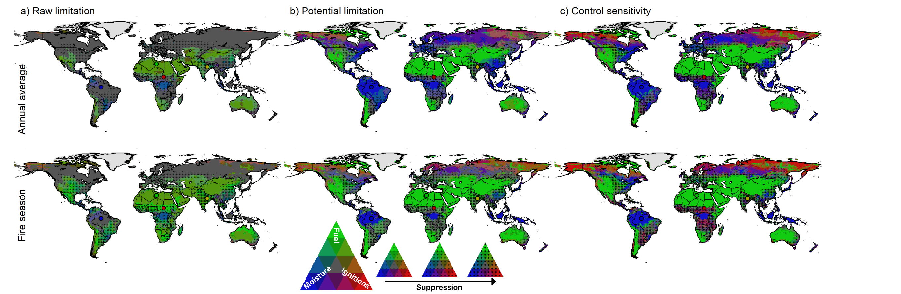
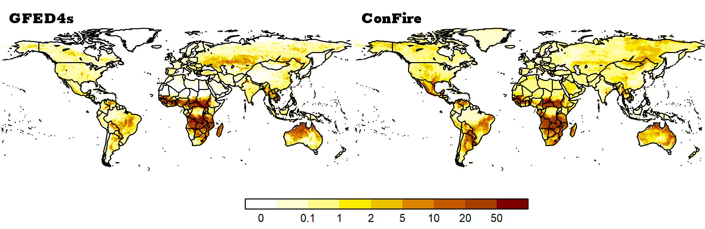
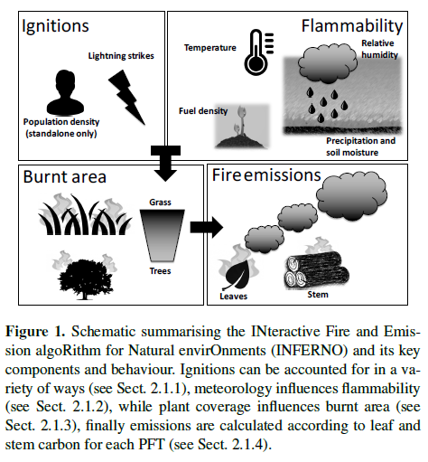
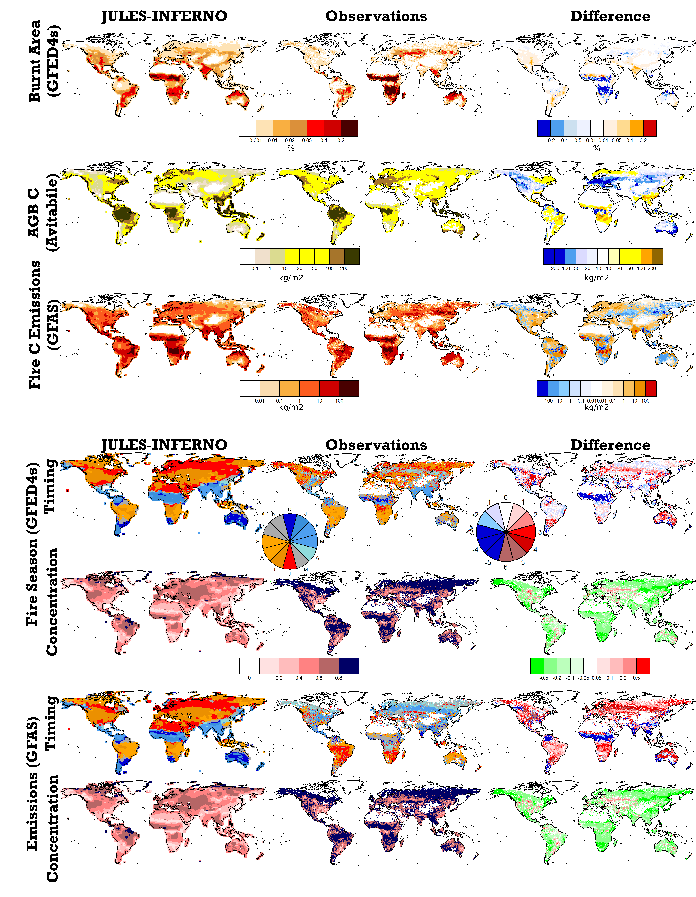

# Quantifying fire module performance through increased LS and ESM couping

### ConFire

[Model optimization](https://github.com/rhyswhitley/fire_limitation)

[Model analysis](https://github.com/douglask3/LimFIRE)

Burnt area constructed as a combination of the limitations split between the four controls:
* fuel (dis)continuity (referred hereafter as “fuel”) represented by variables describing vegetation cover and maximum annual  anomaly;
* fuel moisture (“moisture”) represented by , fractional tree cover and atmospheric drying potential, which combines dry days, maximum temperature and relative humidity
* potential ignitions (“ignition”) represented by lightning strikes, population density and pasture cover; and
* anthropogenic suppression (“suppression”) represented by cropland and population density (see methods for model construction and data sources). Each control is expressed as a linear combination of their respective variables, and limitation imposed by each control is represented by a logistic curve (figure 1). 

Burnt area is constructed by multiplying the maximum permitted fire by each control. 

The contribution of each variable to their control and the shape of the control curves against monthly observations of burnt area from GFEDs using an iterative Bayesian inference technique.

### INFERNO

[Mangeon et al., 2016](http://www.geosci-model-dev.net/9/2685/2016/gmd-9-2685-2016.pdf) was developed
A simple, stable parameterization
to diagnose fire occurrence, burned area, and biomass
burning emissions in the context of an Earth system model building upon the fire parameterization proposed by [Pechony
and Shindell 2009](http://onlinelibrary.wiley.com/doi/10.1029/2009JD011927/full).

It is an empirical scheme that uses vapor pressure deficit, precipitation, and soil moisture to diagnose burned area.
Humans only explicitly impact biomass burning through the number of fires. 
Vegetation-dependent average burned area:
0.6, 1.4, and 1.2 km2
for fires in trees, grasses, and shrubs,
respectively. 

