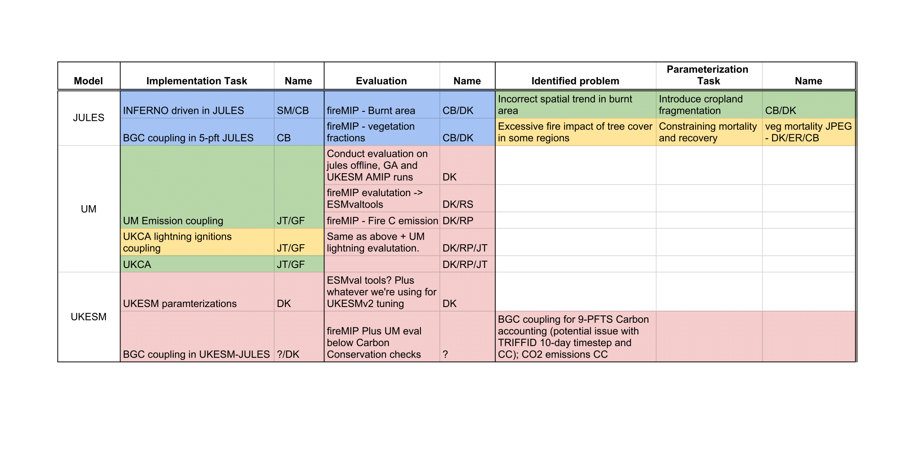

# UKESM fire coupling

## Where we are

* Blue = done
* Green = ongoing
* yellow = planned
* red = stuff to figure out

## INFERNO

### Overview

[Mangeon et al., 2016](http://www.geosci-model-dev.net/9/2685/2016/gmd-9-2685-2016.pdf) was developed
A simple, stable parameterization
to diagnose fire occurrence, burned area, and biomass
burning emissions in the context of an Earth system model building upon the fire parameterization proposed by [Pechony
and Shindell 2009](http://onlinelibrary.wiley.com/doi/10.1029/2009JD011927/full).

It is an empirical scheme that uses vapor pressure deficit, precipitation, and soil moisture to diagnose burned area.
Humans only explicitly impact biomass burning through the number of fires. 
Vegetation-dependent average burned area:
0.6, 1.4, and 1.2 km2
for fires in trees, grasses, and shrubs,
respectively. 

### Offline Evaluation

#### Physical Model

***Add Trend Figure***

#### BGC impacts

### Parameterization

#### Cropland fragmentation

* Implement cropland fragmentation on burnt area based on Kelley et al. in prep, using "suppression index" curve:

* Veg-dependent average fire size re-scaled against GFED4s
* Impact on offline INFERNO:

* Needs re-benchmarking

#### Veg mortality

Vegetation mortality (inc. fire, generic and land use exclusion) and vegetation recovery rate are being constrained as part of the veg distribution JULES PEG:

* <a href="https://docs.google.com/document/d/1J2eMRyYfYdrsI8L5nwVVPRFVVW-TOsy5r8hLdefNEy8/edit?usp=sharing">Veg mortality JPEG</a>
* <a href="https://docs.google.com/document/d/1uS7Nks2N3GOsp_q8eeHcVF6YR-0hj2Uu08RwcBC7yTg/edit?usp=sharing">Mortality optimization</a>

